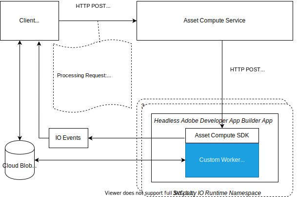

# Componentes internos de um aplicativo personalizado {#how-custom-application-works}

Use a ilustração a seguir para entender o fluxo de trabalho completo quando um ativo digital é processado usando um aplicativo personalizado por um cliente.



*Figura: etapas envolvidas no processamento de um ativo usando o Adobe [!DNL Asset Compute Service].*

## Registro {#registration}

O cliente deve chamar [`/register`](api.md#register) uma vez antes da primeira solicitação para [`/process`](api.md#process-request) para que possa configurar e recuperar a URL do diário para receber Adobe [!DNL I/O Events] Eventos para Adobe Asset compute.

```sh
curl -X POST \
  https://asset-compute.adobe.io/register \
  -H "x-ims-org-id: $ORG_ID" \
  -H "x-gw-ims-org-id: $ORG_ID" \
  -H "Authorization: Bearer $JWT_TOKEN" \
  -H "x-api-key: $API_KEY"
```

A biblioteca JavaScript [`@adobe/asset-compute-client`](https://github.com/adobe/asset-compute-client#usage) pode ser usada em aplicativos NodeJS para manipular todas as etapas necessárias, desde o registro, processamento até a manipulação de eventos assíncronos. Para obter mais informações sobre os cabeçalhos obrigatórios, consulte [Autenticação e Autorização](api.md).

## Processamento {#processing}

O cliente envia uma solicitação [processando](api.md#process-request).

```sh
curl -X POST \
  https://asset-compute.adobe.io/process \
  -H "x-ims-org-id: $ORG_ID" \
  -H "x-gw-ims-org-id: $ORG_ID" \
  -H "Authorization: Bearer $JWT_TOKEN" \
  -H "x-api-key: $API_KEY" \
  -d "<RENDITION_JSON>
```

O cliente é responsável por formatar corretamente as representações com URLs pré-assinados. A biblioteca JavaScript [`@adobe/node-cloud-blobstore-wrapper`](https://github.com/adobe/node-cloud-blobstore-wrapper#presigned-urls) pode ser usada em aplicativos NodeJS para pré-assinar URLs. Atualmente, a biblioteca é compatível apenas com o Armazenamento de blobs do Azure e com os Contêineres do AWS S3.

A solicitação de processamento retorna um `requestId` que pode ser usado para sondar [!DNL Adobe I/O] Eventos.

Um exemplo de solicitação de processamento de aplicativo personalizado está abaixo.

```json
{
    "source": "https://www.adobe.com/some-source-file.jpg",
    "renditions" : [
        {
            "worker": "https://my-project-namespace.adobeioruntime.net/api/v1/web/my-namespace-version/my-worker",
            "name": "rendition1.jpg",
            "target": "https://some-presigned-put-url-for-rendition1.jpg",
        }
    ],
    "userData": {
        "my-asset-id": "1234567890"
    }
}
```

O [!DNL Asset Compute Service] envia as solicitações de representação do aplicativo personalizado para o aplicativo personalizado. Ele usa um POST HTTP para o URL de aplicativo fornecido, que é o URL de ação da Web seguro do App Builder. Todas as solicitações usam o protocolo HTTPS para maximizar a segurança dos dados.

O [SDK do Asset Compute](https://github.com/adobe/asset-compute-sdk#adobe-asset-compute-worker-sdk) usado por um aplicativo personalizado lida com a solicitação POST HTTP. Também é capaz de fazer download da origem, carregar representações, enviar Adobe [!DNL I/O Events] e manipular erros.

<!-- TBD: Add the application diagram. -->

### Código do aplicativo {#application-code}

O código personalizado só precisa fornecer um retorno de chamada que use o arquivo de origem disponível localmente (`source.path`). O `rendition.path` é o local para colocar o resultado final de uma solicitação de processamento de ativo. O aplicativo personalizado usa o retorno de chamada para transformar os arquivos de origem disponíveis localmente em um arquivo de representação usando o nome transmitido (`rendition.path`). Um aplicativo personalizado deve gravar em `rendition.path` para criar uma representação:

```javascript
const { worker } = require('@adobe/asset-compute-sdk');
const fs = require('fs').promises;

// worker() is the entry point in the SDK "framework".
// The asynchronous function defined is the rendition callback.
exports.main = worker(async (source, rendition) => {

    // Tip: custom worker parameters are available in rendition.instructions.
    console.log(rendition.instructions.name); // should print out `rendition.jpg`.

    // Simplest example: copy the source file to the rendition file destination so as to transfer the asset as is without processing.
    await fs.copyFile(source.path, rendition.path);
});
```

### Baixar arquivos de origem {#download-source}

Um aplicativo personalizado só lida com arquivos locais. O [SDK do Asset Compute](https://github.com/adobe/asset-compute-sdk#adobe-asset-compute-worker-sdk) manipula o download do arquivo de origem.

### Criação de representação {#rendition-creation}

O SDK chama uma [função de retorno de chamada de representação](https://github.com/adobe/asset-compute-sdk#rendition-callback-for-worker-required) assíncrona para cada representação.

A função de retorno de chamada tem acesso aos objetos [origem](https://github.com/adobe/asset-compute-sdk#source) e [representação](https://github.com/adobe/asset-compute-sdk#rendition). O `source.path` já existe e é o caminho para a cópia local do arquivo de origem. O `rendition.path` é o caminho onde a representação processada deve ser armazenada. A menos que o sinalizador [disableSourceDownload](https://github.com/adobe/asset-compute-sdk#worker-options-optional) esteja definido, o aplicativo deve usar exatamente o `rendition.path`. Caso contrário, o SDK não poderá localizar ou identificar o arquivo de representação e falhará.

A simplificação excessiva do exemplo é feita para ilustrar e se concentrar na anatomia de um aplicativo personalizado. O aplicativo apenas copia o arquivo de origem para o destino da representação.

Para obter mais informações sobre os parâmetros de retorno de chamada de representação, consulte [API do SDK do Asset Compute](https://github.com/adobe/asset-compute-sdk#api-details).

### Fazer upload de representações {#upload-rendition}

Depois que cada representação é criada e armazenada em um arquivo com o caminho fornecido por `rendition.path`, o [SDK do Asset Compute](https://github.com/adobe/asset-compute-sdk#adobe-asset-compute-worker-sdk) carrega cada representação em um armazenamento na nuvem (AWS ou Azure). Um aplicativo personalizado obtém várias representações ao mesmo tempo se, e somente se, a solicitação recebida tiver várias representações apontando para o mesmo URL de aplicativo. O upload para o armazenamento na nuvem é feito após cada representação e antes de executar o retorno de chamada para a próxima representação.

O `batchWorker()` tem um comportamento diferente. Ele processa todas as representações e, somente depois que todas tiverem sido processadas, faz o upload delas.

## [!DNL Adobe I/O] Eventos {#aio-events}

O SDK envia o Adobe [!DNL I/O Events] para cada representação. Estes eventos são do tipo `rendition_created` ou `rendition_failed`, dependendo do resultado. Para obter mais informações, consulte [Asset compute de eventos assíncronos](api.md#asynchronous-events).

## Receber [!DNL Adobe I/O] Eventos {#receive-aio-events}

O cliente consulta o diário de Adobe [!DNL I/O Events] de acordo com sua lógica de consumo. A URL inicial do diário é a fornecida na resposta da API `/register`. Eventos podem ser identificados usando o `requestId` que está presente nos eventos e é o mesmo retornado em `/process`. Cada representação tem um evento separado que é enviado assim que a representação é carregada (ou falha). Ao receber um evento correspondente, o cliente pode exibir ou manipular as representações resultantes.

A biblioteca JavaScript [`asset-compute-client`](https://github.com/adobe/asset-compute-client#usage) simplifica a sondagem do diário usando o método `waitActivation()` para obter todos os eventos.

```javascript
const events = await assetCompute.waitActivation(requestId);
await Promise.all(events.map(event => {
    if (event.type === "rendition_created") {
        // get rendition from cloud storage location
    }
    else if (event.type === "rendition_failed") {
        // failed to process
    }
    else {
        // other event types
        // (could be added in the future)
    }
}));
```

Para obter detalhes sobre como obter eventos de diário, consulte Adobe [[!DNL I/O Events] API](https://developer.adobe.com/events/docs/guides/api/journaling_api/).

<!-- TBD:
* Illustration of the controls/data flow.
* Basic overview, in text and not code, of how an application works.
-->
